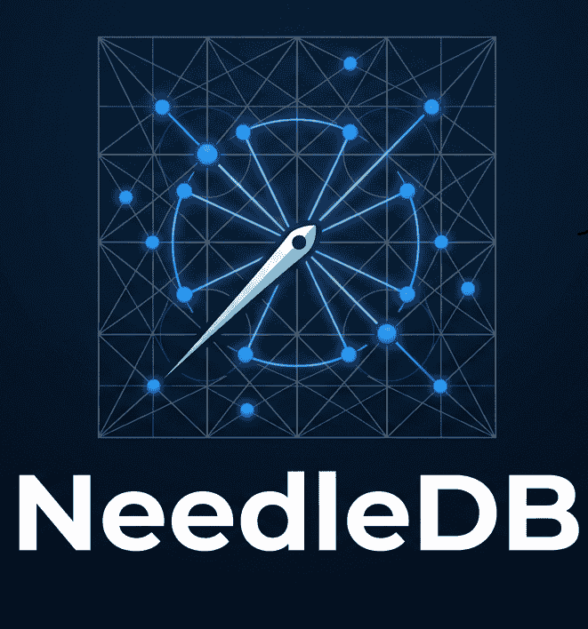
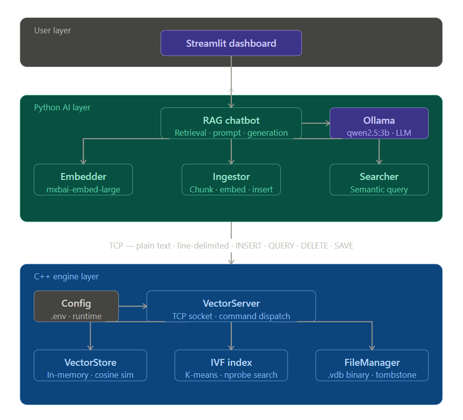
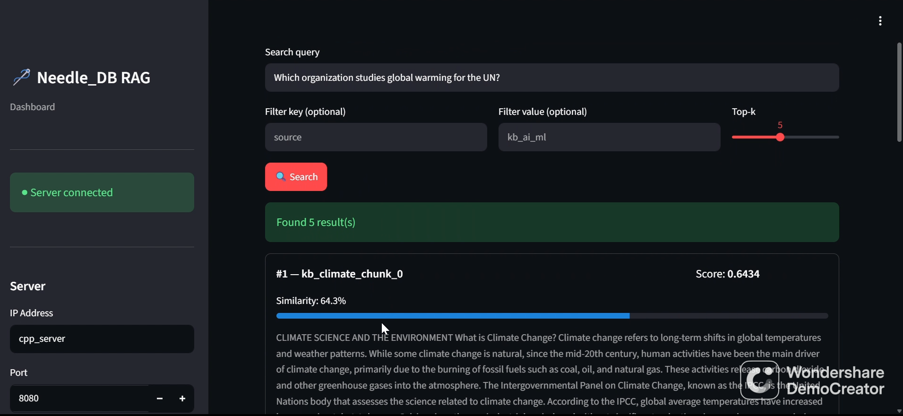
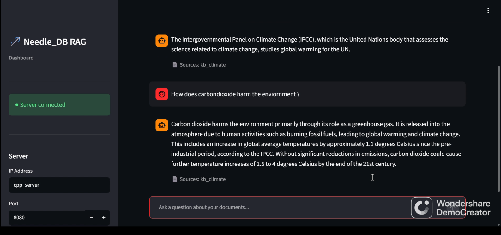

# NeedleDB

NeedleDB is a custom C++ vector database engine and companion Python Retrieval-Augmented Generation (RAG) pipeline communicating over a raw, line-delimited TCP protocol.


**Links:** [Documentation](https://needle-db.web.app) | [Demo](https://drive.google.com/drive/folders/1TcvqczU3JgivnE-Mcrsl8fNHhZMMHtjY?usp=drive_link) | [Docker Hub](https://hub.docker.com/u/husnain80)
## What Is NeedleDB?

NeedleDB provides the underlying infrastructure required for semantic search and Retrieval-Augmented Generation (RAG) pipelines. It ingests unstructured text, stores high-dimensional vector embeddings, and executes mathematical similarity computations to retrieve contextually relevant data. This architecture enables local Large Language Models to answer queries grounded in custom knowledge bases rather than relying solely on pre-trained neural network weights.

Unlike production-ready vector databases that abstract away memory allocation and index mathematics, NeedleDB is built entirely from scratch to expose the internal mechanics of vector storage and retrieval. The architecture handles binary file layouts, raw socket programming, and Inverted File Index (IVF) clustering natively. The primary educational value lies in demonstrating how raw 1024-dimensional floating-point arrays map to human-readable text, and how inverted cluster lists reduce query latency compared to exhaustive O(N) linear scans.

The architecture isolates performance-critical compute from application logic across two distinct layers. The headless C++ engine manages raw binary persistence, memory alignment, and IVF cluster topology, listening for operations over a custom, plain-text, line-delimited TCP protocol. Operating as the middleware and presentation tier, the Python AI layer handles document chunking and vectorization. It generates embeddings using a local Ollama instance (`mxbai-embed-large`) and coordinates the conversational RAG loop with a local `qwen2.5:3b` model, securely translating the C++ engine's internal string identifiers into natural language responses.

## Architecture Overview

The NeedleDB architecture separates performance-bound memory operations from application-level language processing. The system operates across three tiers: a presentation UI, a Python middleware pipeline, and a headless C++ storage engine. Communication between the Python and C++ layers occurs exclusively over a raw, line-delimited TCP protocol. The entire stack deploys via Docker Compose into three isolated containers (`cpp_server`, `python_app`, `ollama`).

<div align="center">
  
</div>

### Component Matrix

| Component | Language | Responsibility |
| :--- | :--- | :--- |
| **VectorStore** | C++ | In-memory flat array, cosine similarity calculations, IVF index delegation |
| **FileManager** | C++ | Binary `.vdb` persistence, 32-byte header validation, tombstone soft-deletes |
| **VectorServer** | C++ | Single-threaded TCP server listening on port 8080, command dispatch |
| **CommandParser** | C++ | Network protocol parsing, format validation for `INSERT`, `QUERY`, `DELETE`, `SAVE` |
| **IVF Index** | C++ | K-means clustering, `nprobe` approximate nearest neighbour search |
| **Embedder** | Python | Local Ollama API integration, executing `mxbai-embed-large` for 1024-d vectors |
| **Ingestor** | Python | Document extraction, 150-word sliding-window chunking, bulk TCP insert pipeline |
| **Searcher** | Python | Semantic query execution with active metadata filtering |
| **RAG Chatbot** | Python | Context retrieval, prompt injection, and generation routing to `qwen2.5:3b` |
| **Streamlit GUI** | Python | User presentation layer containing the Chat UI, Search Explorer, and Knowledge Base manager |

## TCP Protocol

NeedleDB communicates exclusively over a custom TCP socket connection listening on port 8080. The communication layer implements a plain-text, line-delimited protocol where every request and response terminates with a newline character (`\n`). 

The C++ engine currently operates a single-threaded `accept()` loop, processing one client command synchronously before accepting the next. 

### Supported Commands

The protocol exposes four primary operations. For the complete specification, including metadata constraints and error handling, refer to the [Full Protocol Specification](./PROTOCOL.md).

* **INSERT**: Persists a new 1024-dimensional vector record and up to three metadata pairs to the database.
    * **Request:** `INSERT <id> 1024 [key=value ...] f1 f2 ... f1024\n`
    * **Response:** `OK\n`

* **QUERY**: Executes a semantic search against the IVF index, returning the `k` nearest neighbours based on dot-product similarity. Pre-filtering can be applied via metadata key-value pairs.
    * **Request:** `QUERY <k> 1024 [key=value ...] f1 f2 ... f1024\n`
    * **Response:** 
        ``` text
        RESULTS <k>
        <id> <score>
        <id> <score>
        END\n
        ```

* **DELETE**: Applies a tombstone flag to the specified record, marking it as inactive in memory and on disk without reallocating physical storage.
    * **Request:** `DELETE <id>\n`
    * **Response:** `OK\n`

* **SAVE**: Forces a disk flush, synchronizing the binary `.vdb` file header and active records.
    * **Request:** `SAVE\n`
    * **Response:** `OK\n`

## Data Flow

The NeedleDB architecture executes two primary pipelines: Ingestion for data processing and Querying for Retrieval-Augmented Generation. 

### Ingestion Path

The ingestion pipeline processes unstructured documents into persistent, 1024-dimensional mathematical representations.

1. **Document Extraction:** The Python Ingestor reads raw text from supported file formats (`.txt`, `.pdf`, `.docx`).
2. **Chunking:** The text is segmented into distinct blocks (150 words) to maintain semantic density and optimize the embedding window.
3. **Embedding:** The Python Embedder transmits each text block to the local Ollama API. The `mxbai-embed-large` model outputs a 1024-dimensional floating-point array for each chunk.
4. **TCP Transmission:** The Python client formats an `INSERT` command containing a strict 32-character identifier, the 1024 floats, and up to three metadata pairs. This payload is dispatched over the raw TCP socket.
5. **Memory Allocation:** The C++ CommandParser validates the string payload. The VectorStore applies L2 normalization to the vector, appends it to the contiguous flat array in RAM, and registers the new offset with the IVF index for clustering.
6. **Persistence:** The C++ FileManager writes the record directly to disk, appending a fixed-size binary struct to the `.vdb` file to ensure durability.

### Query Path

The retrieval pipeline translates a user prompt into a semantic search, surfacing context to ground the Large Language Model.

1. **Query Formulation:** The user submits a natural language question through the Streamlit presentation layer.
2. **Embedding:** The Python Embedder processes the raw question string through the `mxbai-embed-large` model, outputting a 1024-dimensional query vector.
3. **TCP Transmission:** The Python client dispatches a `QUERY` command to the C++ server, specifying the required `k` nearest neighbours, optional metadata filters, and the query vector floats.
4. **Approximate Search:** The C++ engine delegates the search to the IVF index. The index calculates the Euclidean distance against all cluster centroids, selects the `nprobe` closest clusters, and executes a highly optimized dot-product similarity sweep exclusively against those candidate vectors.
5. **Context Assembly:** The C++ server returns the top `k` identifiers and their respective similarity scores. The Python RAG Chatbot cross-references these 32-character identifiers against a local JSON dictionary to retrieve the original raw text chunks.
6. **LLM Generation:** The retrieved text chunks are concatenated into a strict system prompt alongside the user's original question. This aggregate payload is routed to the local `qwen2.5:3b` model via Ollama to generate the final, contextually grounded answer.

## Quick Start

**Prerequisite:** Docker Desktop

Execute the following commands to initialize the environment and start the containers:

```bash
git clone <https://github.com/husnain-official/Needle_DB>
cd NeedleDB
cp .env.example .env
docker compose up
```
Navigate to http://localhost:8501 in a web browser to access the Streamlit presentation layer.  
> **Note:** on Initial Startup: During the first boot sequence, the Ollama container will pull the `mxbai-embed-large` and `qwen2.5:3b` models. This process requires downloading approximately `2.4GB` of data and will extend the initial startup duration.

> **Note:** on Data Ingestion: Before executing queries, use the Knowledge Base manager in the `Streamlit sidebar` to upload `.txt, .pdf, or .docx` files. The Python pipeline will parse, chunk, embed, and transmit the data over TCP to populate the C++ IVF index.

## Configuration

System runtime parameters are defined in a `.env` file located in the project root. The following table specifies the environment variables, their default values for the Docker Compose deployment, and their operational roles within the NeedleDB architecture.

| Variable | Default | Description |
| :--- | :--- | :--- |
| `EMBEDDING_MODEL` | `mxbai-embed-large` | Ollama embedding model |
| `LOCAL_LLM_MODEL` | `qwen2.5:3b` | Ollama generation model |
| `EMBEDDING_DIMS` | `1024` | Must match model output dims |
| `IP` | `cpp_server` | C++ server host (use localhost outside Docker) |
| `PORT` | `8080` | TCP server port |
| `OLLAMA_HOST` | `http://ollama:11434` | Ollama service URL |
| `VECDB_DATA_PATH` | `./data/database.vdb` | Binary database file path |
| `DOC_PATH` | `./data/documents` | Knowledge base documents folder |

## Project Structure

The repository follows a strict separation of concerns, isolating the C++ storage engine from the Python middleware and presentation layers.

```text
Project Root/
├── app/
│   └── rag_chatbot.py          # Orchestrates retrieval context and local LLM chat loop
├── client/
│   └── vecdb_client.py         # Handles low-level TCP serialization and network protocol constraints
├── data/
│   ├── documents/              # Directory from where files are ingested into the RAG chatbot
│   ├── chunk_store.json        # Local JSON cache mapping vector IDs to raw text chunks (Runtime-Generated)
│   └── database.vdb            # Persistent binary file containing raw vector records and headers (Runtime-Generated)
├── pipeline/
│   ├── embedder.py             # Integrates Ollama backend for mxbai-embed-large (1024-d) execution
│   ├── ingestor.py             # Document parser and sliding-window text-chunking engine
│   └── searcher.py             # Independent search utility for direct database querying
├── include/
│   ├── command_parser.h        # Headers for protocol parsing
│   ├── file_manager.h          # Headers for disk I/O operations
│   ├── ivf.h                   # Headers for the Inverted File Index
│   ├── similarities.hpp        # Inlined math execution routines for L2 distance and dot products
│   ├── types.h                 # Data primitives including Vector, Metadata_entry, and Query_result
│   ├── vector_server.h         # Headers for the TCP server logic
│   └── vector_store.h          # Headers for the in-memory array management
├── src/
│   ├── command_parser.cpp      # Request validation and token parsing logic
│   ├── file_manager.cpp        # Low-level disk I/O handling the 32-byte aligned database header
│   ├── ivf.cpp                 # K-Means clustering algorithm and centroid list management
│   ├── main.cpp                # System entry point instantiating the database layers and server socket
│   ├── vector_server.cpp       # Direct socket handling loop (binds to port 8080)
│   └── vector_store.cpp        # RAM-allocated flat array structures handling runtime query sorting
├── tests/                      # Tests for individual files
├── assets/
    ├── architecture.png
    ├── logo.png
    ├── banner.png
    └── demo-screenshot.png                     
├── app_gui.py                  # Streamlit orchestration script launching the presentation layer dashboard
├── .env.example                # Pre-set values and paths
├── CMakeLists.txt              # CMake configuration file
├── README.md                   # Primary project documentation
├── Protocol.md                 # Protocol specification for the internal TCP connection
├── architecture.md             # High-level architecture documentation
├── Dockerfile.cpp              # Docker image configuration for the C++ server
├── Dockerfile.python           # Docker image configuration for the Python layer
└── docker-compose.yml          # Docker Compose configuration for multi-container deployment
```
## Screenshots
**Screenshot of Semantic Search:**
<div align="center">
  
</div>  

**Screenshot of Rag-Bot:**
<div align="center">
  
</div>

## Demo

A video demo going thorugh all features starting from `docker compose up`:
[Video_Demo](https://drive.google.com/drive/folders/1TcvqczU3JgivnE-Mcrsl8fNHhZMMHtjY?usp=drive_link)

## Known Limitations

The current architecture prioritizes structural transparency over production-grade resilience. The following constraints define the operational boundaries of the system:

* **Single-Threaded Execution:** The C++ `Vector_Server` utilizes a synchronous `accept()` loop. It processes one client connection at a time, queuing concurrent requests in the socket backlog.
* **Memory Bound (RAM Dependency):** The engine loads all active 1024-dimensional vectors from the `.vdb` file into a contiguous flat `std::vector` array during startup to execute dot-product similarity calculations. Resource exhaustion will occur if the dataset exceeds available system RAM.
* **Ephemeral IVF Indexing:** The K-Means clustering topology is not persisted to disk. The IVF index rebuilds from scratch upon every server initialization, increasing boot latency linearly with dataset size.
* **Unauthenticated TCP Socket:** The server listens on port 8080 without encryption, TLS, or authentication handshakes, making it unsuitable for exposure to untrusted public networks.
* **Decoupled Text Storage:** The C++ engine stores only numerical floats, metadata pairs, and string identifiers. Raw text chunks are maintained externally in a Python-managed `chunk_store.json` file. A desync between the binary database and the JSON cache results in inaccessible context.
* **Initial Boot Payload:** The first execution of the Docker Compose stack requires pulling the `mxbai-embed-large` and `qwen2.5:3b` models via the Ollama container, consuming approximately 2.4GB of bandwidth and storage.
* **Crash Vulnerability (No WAL):** Disk persistence appends records to the `.vdb` file without a Write-Ahead Log or atomic transactions. Process termination during an `INSERT` operation risks binary file corruption.
* **String Parsing Overhead:** The network protocol transmits floating-point arrays as plain text. The reliance on string-to-float conversion (`std::stof`) during the `INSERT` and `QUERY` pipelines incurs CPU overhead and risks floating-point precision loss compared to IEEE 754 raw binary transmission.

## What Was Intentionally Not Used

The architecture of NeedleDB deliberately omits several industry-standard tools to maximize exposure to low-level system design.

* **Managed Vector Databases (Pinecone, Weaviate):** Integrating an off-the-shelf vector database abstracts away the core mechanics of vector storage. NeedleDB implements its own storage engine to explicitly handle fixed-size binary record I/O, contiguous flat array memory management, and the underlying mathematics of Inverted File Index (IVF) clustering.
* **Cloud Embedding APIs (OpenAI):** Cloud-based models require external network routing and API key management. NeedleDB operates as a fully local system. The architecture relies on Ollama to execute `mxbai-embed-large` and `qwen2.5:3b` directly on the host hardware, eliminating external API dependencies.
* **HTTP/REST APIs:** Wrapping the database in an HTTP layer requires importing a web server framework. A raw TCP socket approach was chosen as an explicit protocol design exercise. This exposes the mechanics of parsing incoming byte streams, enforcing a custom line-delimited text protocol, and managing socket lifecycles directly via POSIX APIs.

## Running Without Docker (Developer Setup)

Running the architecture natively requires compiling the C++ engine from source and executing the Python middleware in a local virtual environment. Ollama must be installed natively on the host machine to serve the 1024-dimensional embedding and generation models.

### 1. C++ Engine Compilation

The C++ server requires a C++17 compliant compiler (GCC or Clang) and CMake. 

```bash
mkdir build
cd build
cmake ..
make
./NeedleDB
```
The server will initialize, allocate the in-memory VectorStore, and listen for TCP connections on localhost:8080.  
> **Note for WSL users:** Windows Defender natively blocks inbound TCP traffic from reaching WSL instances. To allow external network requests to pass through the Windows host to the C++ server operating on port 8080, an explicit firewall exception is required. Execute the following command within an elevated Windows PowerShell (Run as Administrator):
```
New-NetFirewallRule -DisplayName "NeedleDB Server WSL Allow" -Direction Inbound -LocalPort 8080 -Protocol TCP -Action Allow
```
### 2. Python AI Layer Setup
The Streamlit presentation layer and ingestion pipelines require Python 3.11 or higher.
```
python3 -m venv .venv
source .venv/bin/activate
pip install streamlit python-dotenv pypdf python-docx ollama
```
### 3. Ollama Configuration Scenarios
The Python Embedder and RAG Chatbot rely on the `OLLAMA_HOST` environment variable defined in .env to locate the Ollama daemon. Configure the `.env file` and pull the required models (`mxbai-embed-large` and `qwen2.5:3b`) based on your operating system architecture.

### Scenario 1: WSL (Ollama Installed Natively Inside WSL)
If the Ollama Linux binary executes directly within the WSL filesystem:
.env Configuration:
```
OLLAMA_HOST=http://localhost:11434
IP=localhost
```
Model Initialization:
```
ollama pull mxbai-embed-large
ollama pull qwen2.5:3b
```
### Scenario 2: WSL (Ollama Installed on Windows Host)
If WSL must communicate with the Windows native Ollama application, Windows Defender blocks the incoming TCP traffic by default.

`Step 1`: Apply PowerShell Firewall Exception (Run as Administrator in Windows)  
```
New-NetFirewallRule -DisplayName "Ollama WSL Allow" -Direction Inbound -LocalPort 11434 -Protocol TCP -Action Allow
```
`Step 2`: Retrieve Windows Host IP (Run inside WSL terminal)
```
ip route | grep default
```
Extract the IP address following via (e.g., 172.18.96.1).  
`Step 3`: .env Configuration
```
OLLAMA_HOST=http://172.18.96.1:11434
IP=localhost
```
### Scenario 3: Pure Linux (Ubuntu/Debian/Arch)
For native Linux environments executing the standard Ollama installation script:

.env Configuration:
```
OLLAMA_HOST=http://localhost:11434
IP=localhost
```
Model Initialization:
```
ollama pull mxbai-embed-large
ollama pull qwen2.5:3b
```
### Scenario 4: macOS
For Apple Silicon or Intel hardware running the native macOS Ollama application:

.env Configuration:
```
OLLAMA_HOST=http://localhost:11434
IP=localhost
```
Model Initialization:
```
ollama pull mxbai-embed-large
ollama pull qwen2.5:3b
```
### 4. Execution
Ensure the .env file matches your scenario constraints. With the C++ server actively listening and Ollama models cached locally, launch the Python presentation layer:
```
streamlit run app_gui.py
```

## Documentation

The complete Doxygen API documentation detailing the C++ storage engine structures, network protocol interfaces, and Python middleware architecture is available at:
[https://needle-db.web.app](https://needle-db.web.app)

