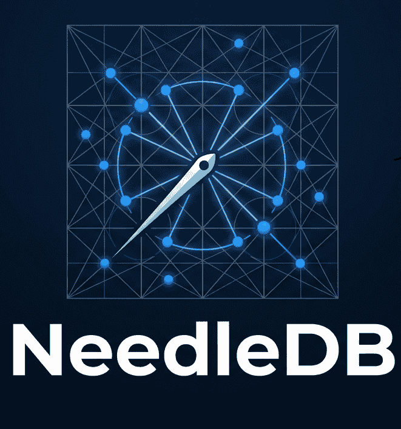
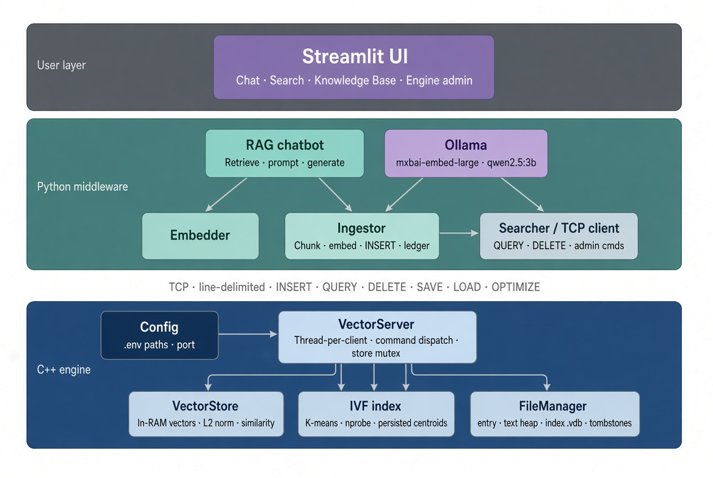
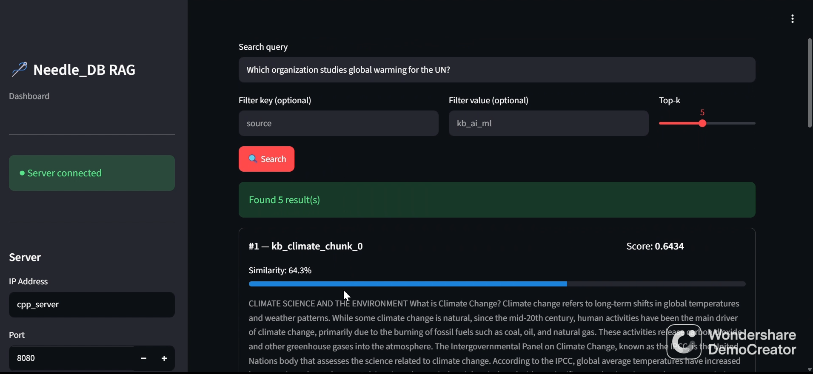
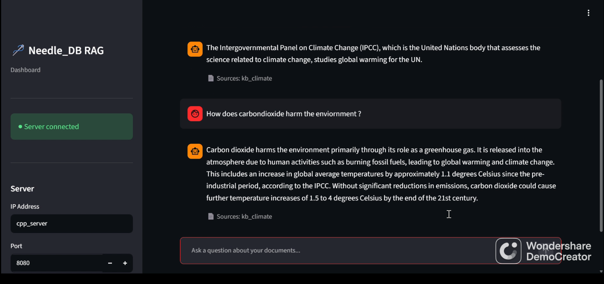

# NeedleDB

**v2 · individual-lite** — a from-scratch C++ vector database engine with a Python RAG middleware and Streamlit UI, speaking a raw line-delimited TCP protocol.


**Links:** [Documentation site](https://needle-db.web.app) | [Demo](https://drive.google.com/drive/folders/1TcvqczU3JgivnE-Mcrsl8fNHhZMMHtjY?usp=drive_link) | [Docker Hub](https://hub.docker.com/u/husnain80) | [GitHub](https://github.com/husnain-official/Needle_DB)

---

## What this is

NeedleDB is infrastructure for **semantic search** and **retrieval-augmented generation (RAG)** that you can read end-to-end. It ingests unstructured text, stores 1024-dimensional embeddings, and retrieves neighbours by similarity so a local LLM can answer from *your* documents instead of weights alone.

It is **not** a drop-in replacement for Pinecone, Weaviate, or FAISS wrappers. Those hide allocation, indexing, and persistence. NeedleDB does the opposite: fixed binary records, an explicit TCP grammar, k-means IVF, soft deletes, and compaction are all visible in the repo.

**Two layers:**

| Layer | Role |
| :--- | :--- |
| **C++ engine** (headless) | Binary `.vdb` files, in-RAM store, IVF, TCP server on port 8080 |
| **Python middleware + Streamlit** | Chunking, Ollama embeddings/generation, RAG loop, UI, client-side ingest ledger |

They never share memory or files for business logic. Python talks to the engine **only** over TCP. See [docs/protocol.md](docs/protocol.md).

---

## What changed from v1

v1 was the first public shape of NeedleDB: a working engine + Python RAG path, but with several design corners that forced desync risk, slow boots, and a strictly serial server. **v2 (individual-lite)** keeps the same educational goal and local Ollama stack; it changes the storage and concurrency contracts.

| Area | v1 | v2 (this release) |
| :--- | :--- | :--- |
| **Text storage** | Engine stored vectors + ids + metadata only. Raw chunk text lived in a Python `chunk_store.json`. Engine and JSON could drift. | Engine owns a separate **text heap** file (`database_text.vdb`). `QUERY` returns text inline. No chunk JSON as source of truth. |
| **`INSERT` shape** | Id + dims + floats (+ metadata); text was not a first-class engine field. | `INSERT <id> <text_length> <text> <dims> …` — length-prefixed text may contain spaces. |
| **Protocol replies** | Mostly bare `OK\n`. | Descriptive lines: `INSERT <Successful>`, `DELETE <Successful>, Compaction<Successful>`, `ERROR <…>`, etc. |
| **Commands** | `INSERT`, `QUERY`, `DELETE`, `SAVE` (and related early forms). | Adds **`LOAD`**, **`OPTIMIZE`**, auto-compaction on delete, insert-time OPTIMIZE warnings. |
| **IVF at boot** | Centroids were effectively **ephemeral** — full rebuild on every server start. | Centroids + `last_build_at` **persisted** in `database_index.vdb`; boot can load lists without re-running k-means. |
| **Concurrency** | Single-threaded style accept/handle: one client command path at a time. | **Thread-per-client** + coarse `store_mutex_` around store/index/file ops. |
| **Schema** | Limits scattered / harder to keep client and server aligned. | **`schema.hpp` SSOT**; Python `schema_loader` parses it at connect time. |
| **Repo layout** | Flatter mixed tree. | `services/engine` (C++) and `services/client` (Python + Streamlit). |
| **UI bookkeeping** | Relied on in-process or JSON chunk maps that vanished or desynced easily. | **Ingestion ledger** (`ingestion_ledger.json`) for document/chunk status in the UI (still not engine STATS). |
| **Docs** | README-centric; protocol file went stale. | Split reference: `engine.md`, `protocol.md`, `middleware.md`, `performance.md`. |
| **Tooling** | C++17-oriented messaging in places. | Engine built as **C++20** in current CMake; Docker images tagged for 2.0.0. |

**Unchanged on purpose:** raw TCP (not HTTP), local Ollama models, fixed 1024-d vectors, educational exposure of binary layout and IVF math, MIT license, no cloud vector DB dependency.

Breaking for old clients: any v1 client that expected `OK\n`, Python-side text only, or the old `INSERT` framing will not speak v2 correctly. Use the v2 Python client or follow [docs/protocol.md](docs/protocol.md).

## Architecture

<div align="center">
  
</div>

### Components

| Component | Language | Responsibility |
| :--- | :--- | :--- |
| **VectorStore** | C++ | In-memory ids, embeddings, metadata; normalization; similarity |
| **FileManager** | C++ | Entry / text / index `.vdb` files, header validation, compaction |
| **IVF index** | C++ | K-means centroids, inverted lists, `nprobe` search; centroids persisted |
| **VectorServer** | C++ | `accept` loop, one detached thread per client, store mutex |
| **CommandParser** | C++ | Line protocol validation for all commands |
| **vecdb_client** | Python | TCP framing, schema-aware validation, timeouts |
| **Ingestor / ledger** | Python | File → chunks → embed → `INSERT`; JSON ingest history for the UI |
| **RAG chatbot** | Python | Retrieve → prompt → local LLM |
| **Streamlit UI** | Python | Chat, Search Explorer, Knowledge Base, engine admin |

Deeper detail: [docs/engine.md](docs/engine.md) · [docs/middleware.md](docs/middleware.md)

---

## Quick start (Docker — recommended)

**Prerequisite:** Docker with Compose v2.

```bash
git clone https://github.com/husnain-official/Needle_DB.git
cd Needle_DB
cp .env.example .env
docker compose up
```

| Service | URL / port |
| :--- | :--- |
| Streamlit UI | http://localhost:8501 |
| C++ engine | TCP `localhost:8080` |
| Ollama | internal `http://ollama:11434` (from other containers) |

**First boot:** the `ollama_init` job pulls `mxbai-embed-large` and `qwen2.5:3b` (~2.4 GB). Later starts reuse the `ollama_data` volume.

**Data:** vectors and the client ledger live on the shared `db_data` volume. Reset both with:

```bash
docker compose down -v
```

**Images (when published):** `husnain80/needledb-server:2.0.0` · `husnain80/needledb-app:2.0.0`

In the UI: **Connect** (defaults match Docker service names), load or upload documents under **Knowledge Base**, then use **Chat** or **Search Explorer**. Sidebar **Engine Admin** exposes `OPTIMIZE`, `SAVE`, `LOAD`, and delete helpers.

---

## Configuration

Runtime settings are plain `key=value` lines in `.env` (no spaces around `=` — the C++ loader is strict).

| Variable | Docker default | Who uses it |
| :--- | :--- | :--- |
| `EMBEDDING_MODEL` | `mxbai-embed-large` | Python / Ollama |
| `LOCAL_LLM_MODEL` | `qwen2.5:3b` | Python / Ollama |
| `OLLAMA_HOST` | `http://ollama:11434` | Python |
| `IP` | `cpp_server` | Python (engine host) |
| `PORT` | `8080` | Python + C++ |
| `VECDB_ENTRY_DATA_PATH` | `services/engine/data/database_entry.vdb` | C++ |
| `VECDB_TEXT_DATA_PATH` | `services/engine/data/database_text.vdb` | C++ |
| `VECDB_INDEX_DATA_PATH` | `services/engine/data/database_index.vdb` | C++ |

Structural limits (dimensions, id length, text max, IVF caps, optimize thresholds) live in `services/engine/include/schema.hpp`. The Python side loads them at connect time via `schema_loader.py` so the client does not invent its own wire limits.

Native (non-Docker) development typically sets `IP=localhost` and `OLLAMA_HOST=http://localhost:11434`.

---

## Project layout

```text
├── services/
│   ├── engine/                 # C++ server, tests, Dockerfile.cpp
│   │   ├── include/            # schema.hpp is the binary/protocol SSOT
│   │   ├── src/
│   │   ├── tests/              # GoogleTest suites
│   │   └── data/               # *.vdb at runtime
│   └── client/                 # Python middleware + Streamlit
│       ├── app/                # rag_chatbot.py
│       ├── pipeline/           # embedder, ingestor, ledger, searcher
│       ├── vecdb_client.py
│       ├── app_gui.py
│       └── data/               # ledger + knowledge_base/
├── docs/                       # engine, protocol, middleware, performance
├── docker-compose.yml
├── .env.example
└── README.md
```

---

## TCP protocol (summary)

Line-delimited text on TCP. One command per round-trip (except `QUERY`, which returns multiple lines ending with `END`).

| Command | Purpose |
| :--- | :--- |
| `INSERT` | Store id + length-prefixed text + optional metadata + 1024 floats |
| `QUERY` | Top-k IVF search; results include text inline |
| `DELETE` | Soft-delete by id; may auto-compact |
| `SAVE` / `LOAD` / `OPTIMIZE` | Flush header · reload+rebuild · rebuild IVF centroids |

Full grammar and error shapes: **[docs/protocol.md](docs/protocol.md)**.

---

## Data flow

### Ingest

1. Read `.txt` / `.pdf` / `.docx`  
2. Chunk (~150 words; each chunk ≤ 1200 **bytes** on the wire)  
3. Embed with Ollama  
4. `INSERT` over TCP (engine L2-normalizes and assigns an IVF list)  
5. Record success/partial/fail in the **client ledger** (UI bookkeeping only)

### Query / chat

1. Embed the question  
2. `QUERY` → ids, scores, text  
3. Filter by minimum score, build prompt, call `qwen2.5:3b`  
4. Show answer and sources in Streamlit  

Engine search at tens of thousands of 1024-d vectors is typically **tens of milliseconds** in the published microbenchmarks. End-to-end chat on **CPU-only** hardware is often **~10 seconds** because embedding + LLM decode dominate—not IVF. Details: **[docs/performance.md](docs/performance.md)**.

---

## Screenshots

**Semantic search**

<div align="center">
  
</div>

**RAG chat**

<div align="center">
  
</div>

---

## Documentation map

| Document | Contents |
| :--- | :--- |
| [docs/engine.md](docs/engine.md) | On-disk schema, persistence, concurrency, IVF, compaction limits |
| [docs/protocol.md](docs/protocol.md) | Wire protocol only |
| [docs/middleware.md](docs/middleware.md) | Python client, ingest, ledger, RAG, UI responsibilities |
| [docs/performance.md](docs/performance.md) | 181/181 tests, IVF timings, why CPU chat is slow |
| [docs/changes.md](docs/changes.md) | Development history / changelog notes |

---

## Known limitations

NeedleDB prioritises transparency over production hardening.

- **No auth / TLS** — anyone who can open the port can run `DELETE` or `LOAD`.
- **RAM-bound search** — active vectors are held in memory.
- **O(N) id lookup** — delete-by-id scans; fine for learning, not for huge hot id traffic.
- **Blocking maintenance** — `OPTIMIZE`, `LOAD`, and compaction hold the store mutex for the whole operation.
- **Compaction is not crash-safe** — interruption mid-rewrite can corrupt data files.
- **Stale centroids** — inserts assign to existing lists; centroid positions move only on `OPTIMIZE` / `LOAD`.
- **Ledger ≠ engine** — document lists in the UI come from a Python JSON file, not a server `STATS` command (none in v2).
- **CPU LLM latency** — expect multi-second chat without a GPU; see performance doc.
- **POSIX networking** — the engine is built for Linux / macOS / WSL. **Native Windows (MSVC + WinSock-only workflows) is not supported.**

---

## Running without Docker (developers)

Native development means: compile the C++ engine yourself, run Python in a virtualenv, and run Ollama on the host (or on Windows while the rest runs in WSL). **Supported platforms: Linux, macOS, and Windows via WSL2.** The engine uses POSIX sockets; a pure native Windows (MSVC) build is not supported.

Docker remains the easiest path for a first run. Use this section when you are changing engine or middleware code.

### Prerequisites

| Dependency | Notes |
| :--- | :--- |
| **C++20 compiler** | GCC or Clang (`g++ --version` / `clang++ --version`) |
| **CMake** | ≥ 3.13 |
| **Python** | 3.11+ recommended |
| **Ollama** | Installed and able to serve HTTP on port 11434 (or reachable from where Python runs) |
| **Git** | First CMake configure downloads GoogleTest via FetchContent |

Clone and enter the repo:

```bash
git clone https://github.com/husnain-official/Needle_DB.git
cd Needle_DB
cp .env.example .env
```

Edit `.env` for native use **before** starting anything:

```bash
# Typical native values (adjust OLLAMA_HOST for your scenario below)
IP=localhost
PORT=8080
OLLAMA_HOST=http://localhost:11434
```

Leave `VECDB_*_DATA_PATH` as the repo-relative defaults unless you intentionally relocate the data directory. Paths are resolved from the **process working directory** — start the engine from the **repository root**, not from `services/engine/build/`.

---

### 1. C++ engine

```bash
cd services/engine
cmake -B build -DCMAKE_BUILD_TYPE=Release
cmake --build build --target NeedleDB -j"$(nproc)"   # macOS: -j"$(sysctl -n hw.ncpu)"
cd ../..   # back to repository root
```

Start the server from the **repo root** so `.env` and `services/engine/data/...` resolve:

```bash
./services/engine/build/NeedleDB
```

You should see a startup line and a listener on the configured port (default 8080). Leave this terminal open.

**Optional — run tests** (from `services/engine/build` after configure):

```bash
cd services/engine/build
ctest --output-on-failure
```

#### WSL: firewall for the engine port (8080)

Windows Defender often blocks inbound TCP to services running inside WSL. If another machine—or Windows-native tooling—must reach the engine on port 8080, open an **elevated** Windows PowerShell (Run as Administrator):

```powershell
New-NetFirewallRule -DisplayName "NeedleDB Server WSL Allow" -Direction Inbound -LocalPort 8080 -Protocol TCP -Action Allow
```

If you only ever connect from Python **inside the same WSL instance** to `IP=localhost`, you may not need this rule. Add it when connections from Windows host tools or other devices fail with timeouts/refused.

---

### 2. Python middleware

Use a virtual environment at the **repo root** (not inside `build/`):

```bash
python3 -m venv .venv
source .venv/bin/activate
pip install -r services/client/requirements.txt
```

`PYTHONPATH` must include the client package root so `from pipeline...` / `from schema...` work:

```bash
export PYTHONPATH=services/client
streamlit run services/client/app_gui.py
```

Open the URL Streamlit prints (usually http://localhost:8501). In the sidebar, connect to `IP` / `PORT` from `.env` (native: `localhost` / `8080`).

---

### 3. Ollama configuration scenarios

Python reads `OLLAMA_HOST` from `.env`. Pull models once per machine:

```bash
ollama pull mxbai-embed-large
ollama pull qwen2.5:3b
```

#### Scenario A — Pure Linux

Ollama and NeedleDB on the same Linux host.

```bash
# .env
IP=localhost
PORT=8080
OLLAMA_HOST=http://localhost:11434
```

#### Scenario B — macOS

Same as Linux for local sockets:

```bash
# .env
IP=localhost
PORT=8080
OLLAMA_HOST=http://localhost:11434
```

#### Scenario C — WSL, Ollama installed **inside** WSL

Engine, Python, and Ollama all in the Linux environment:

```bash
# .env
IP=localhost
PORT=8080
OLLAMA_HOST=http://localhost:11434
```

#### Scenario D — WSL, Ollama installed on the **Windows host**

Python inside WSL must call Ollama on Windows. `localhost` inside WSL is **not** the Windows host.

**Step 1 — Firewall (elevated Windows PowerShell):**

```powershell
New-NetFirewallRule -DisplayName "Ollama WSL Allow" -Direction Inbound -LocalPort 11434 -Protocol TCP -Action Allow
```

**Step 2 — Windows host IP as seen from WSL:**

```bash
ip route | grep default
```

Use the address after `via` (example: `172.18.96.1`).

**Step 3 — `.env`:**

```bash
IP=localhost
PORT=8080
OLLAMA_HOST=http://172.18.96.1:11434
```

If embeds fail with connection errors, re-check the IP (`ip route` can change after reboot/network changes) and that the Windows Ollama app is running.

---

### 4. Suggested startup order

1. Start **Ollama** (app or `ollama serve`) and confirm models are pulled.  
2. From repo root, start **`./services/engine/build/NeedleDB`**.  
3. Activate `.venv`, set `PYTHONPATH`, run **Streamlit**.  
4. In the UI: Connect → load or upload documents → Chat / Search.

Two terminals minimum (engine + Streamlit); three if you run Ollama in the foreground.

---

### 5. Common native-setup failures

| Symptom | Likely cause |
| :--- | :--- |
| `Error: Server could not read .env file` | Engine not started from **repo root**, or `.env` missing there |
| `Connection refused` on Connect | Engine not running, wrong `IP`/`PORT`, or WSL firewall blocking 8080 from the client you use |
| Ollama timeouts / connection errors | Wrong `OLLAMA_HOST`; models not pulled; Ollama not running; Scenario D missing firewall rule on 11434 |
| `ModuleNotFoundError: pipeline` / `schema` | `PYTHONPATH` not set to `services/client` |
| Schema load failure | Working directory not repo root (loader looks for `services/engine/include/schema.hpp`) |
| Empty UI stats after restart | Expected for a new ledger path; engine data can still exist under `services/engine/data/` |

---

### 6. Data locations (native)

| Path | Contents |
| :--- | :--- |
| `services/engine/data/*.vdb` | Entry, text, and index databases |
| `services/client/data/ingestion_ledger.json` | UI ingest history |
| `services/client/data/knowledge_base/` | Optional documents for “Load KB from folder” |

Delete the `.vdb` files (with the engine stopped) to wipe the vector DB. Delete or edit the ledger to reset UI document status without necessarily wiping the engine.


## Use of AI in this project (transparency)

AI tools were used as accelerators in places where the *design and acceptance criteria* stayed human-owned. This is intentional disclosure, not a claim that the system “wrote itself.”

| Area | How AI was used | What remained human-led |
| :--- | :--- | :--- |
| **C++ core engine** | Occasional implementation help (e.g. sampled k-means build details); review and integration by the author | Schema, protocol, file layout, concurrency model, compaction rules, bug fixes |
| **GoogleTest suites** | Large bodies of test code generated from author-written prompts and failure cases (Gemini and similar) | Which behaviours to lock, gating vs curiosity tests, interpreting failures |
| **Python middleware** | Roughly shared effort: scaffolding and repetitive wiring assisted by AI | Protocol client rules, ledger semantics, RAG behaviour, UI product decisions |
| **Documentation** | Several docs (including structured changelogs and polished reference pages) drafted or rewritten with AI for density and consistency | Technical claims checked against code; limitations called out explicitly |
| **Doxygen / comments** | Often AI-assisted after cleanups | Correctness of behaviour still judged from `.cpp` reality |

**Not** AI-substituted: the choice to use raw TCP instead of HTTP, fixed binary records, separate text heap, thread-per-client + coarse mutex, and the educational goal of keeping every layer readable.

If you are assessing the repo for learning: read `schema.hpp`, `file_manager`, `ivf`, and `protocol.md` first—those define the system more honestly than any generated paragraph.

---

## What was intentionally not used

- **Managed vector DBs** — would hide the storage and index work this project exists to show.  
- **Cloud embedding / chat APIs** — stack stays local via Ollama.  
- **HTTP for the engine** — protocol design and parsing are part of the exercise.  
- **Native Windows engine builds** — POSIX server path only (Linux / macOS / WSL).

---

## License

[MIT](./LICENSE) © 2026 husnain-official

---

## Release tag

**v2-release-individual-lite** — Streamlit UI, Docker Compose path, persisted IVF centroids, client ledger, documented protocol/middleware/performance.
