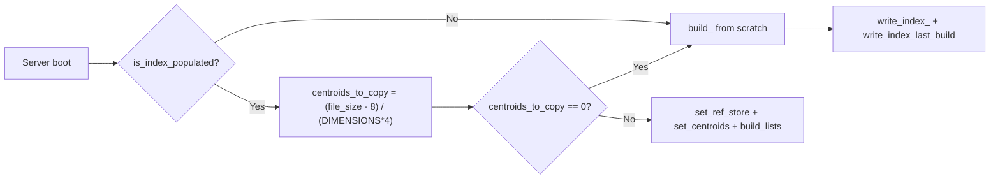
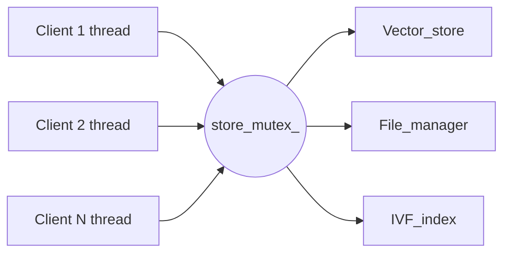
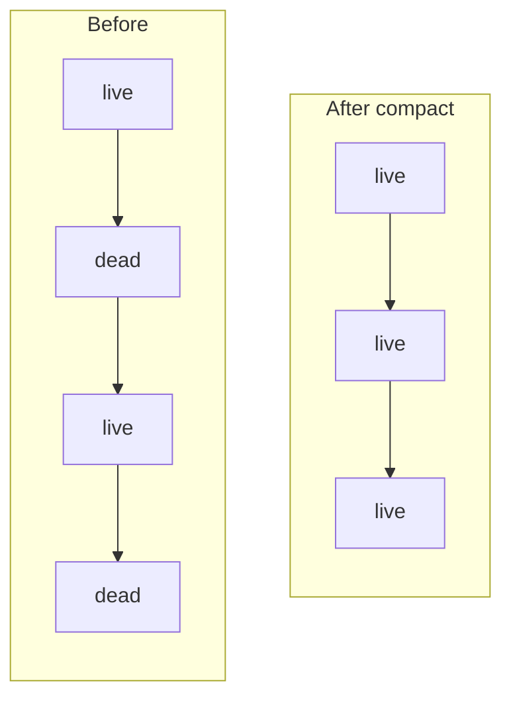

# NeedleDB v2 Engine Architecture & Internals

This document is a technical reference for the NeedleDB v2 C++ storage engine. It details the on-disk binary schema, the TCP communication protocol, the persistence and concurrency models, and the internal workings of the Inverted File Index (IVF). 

It is intended for developers contributing to the engine or building direct clients against the TCP protocol. For a high-level overview or usage instructions, see `README.md`.

## Engine Schema Constants

The following table centralizes all schema limits and tuning factors defined in `schema.hpp` that govern the engine's behavior:

| Constant | Value | Description |
| :--- | :--- | :--- |
| `DIMENSIONS` | 1024 | Fixed number of floating-point elements per vector. |
| `ID_LENGTH` | 32 | Maximum byte length for a vector's unique string ID. |
| `META_DATA_LENGTH` | 32 | Maximum byte length per metadata key or value. |
| `META_DATA_KP_PAIRS` | 3 | Maximum metadata key-value pairs per record. |
| `TEXT_MAX_LENGTH` | 999 | Maximum byte length for an inserted text payload. |
| `VERSION` | 6 | Binary schema version identifier. |
| `MAX_K_SIMILAR` | 30 | Hard upper limit for candidate match count (`top_k`). |
| `MAX_CENTROIDS` | 100 | Target number of k-means clusters for the IVF index. |
| `MAX_PROBES_SEARCH` | 5 | Number of adjacent clusters evaluated during search. |
| `MAX_KMEANS_SAMPLE` | 50000 | Maximum vector sample size for k-means centroid seeding and tuning. |
| `OPTIMIZE_FACTOR` | 2 | Growth multiplier against last build size to trigger optimization warning. |
| `OPTIMIZE_REM_STARTS_AT` | 500 | Minimum active vector count before optimization warnings can trigger. |
| `DELETE_FACTOR` | 8 | Multiplier applied to dead entry count to trigger auto-compaction. |

## On-Disk Binary Schema

NeedleDB stores data in a custom, fixed-size binary format designed for $O(1)$ offset access and strict portability. The schema is enforced at startup; any mismatch in dimensions, limits, or versioning will cause the server to abort.

### Database Header (`DB_header`)

The main database file begins with a strictly packed 32-byte header.

| Field | Type | Size | Description |
| :--- | :--- | :--- | :--- |
| `live_vector_count` | `uint64_t` | 8 bytes | Count of active (non-tombstoned) records. |
| `total_vector_count` | `uint64_t` | 8 bytes | Total records appended, including soft-deleted ones. |
| `magic_number` | `char[4]` | 4 bytes | Hardcoded signature `{'V', 'D', 'B', '\0'}`. |
| `dimensions` | `uint16_t` | 2 bytes | Embedding dimension count (fixed to 1024). |
| `version` | `uint8_t` | 1 byte | Schema version identifier (v6). |
| `id_length` | `uint8_t` | 1 byte | Max ID length (fixed to 32). |
| `kv_length` | `uint8_t` | 1 byte | Max length per metadata key/value (fixed to 32). |
| `max_kv` | `uint8_t` | 1 byte | Max metadata pairs per record (fixed to 3). |
| `padding` | `uint8_t[6]` | 6 bytes | Unused; pads the struct to exactly 32 bytes for alignment. |

*Note: The header is aligned strictly to 1 byte (`#pragma pack(push, 1)`) to guarantee the 32-byte layout across different compilers and platforms without hidden padding.*

### Metadata Entry (`Metadata_entry`)

Each record can hold up to 3 metadata pairs (key-value strings).

| Field | Type | Size | Description |
| :--- | :--- | :--- | :--- |
| `key` | `char[32]` | 32 bytes | Fixed-size array for the metadata key. |
| `value` | `char[32]` | 32 bytes | Fixed-size array for the metadata value. |

*Note: Strings exactly 32 characters long will lack a null-terminator. The engine reads them safely via bounded bounds-checking (`strnlen`).*

### Database Record (`DB_entry`)

Immediately following the 32-byte header are the sequential `DB_entry` records.

| Field | Type | Size | Description |
| :--- | :--- | :--- | :--- |
| `flag` | `uint8_t` | 1 byte | Tombstone flag: `1` for active, `0` for soft-deleted. |
| `id` | `char[32]` | 32 bytes | Unique vector string identifier. |
| `text_offset` | `uint64_t` | 8 bytes | Absolute byte offset in the text database file. |
| `text_length` | `uint16_t` | 2 bytes | Byte length of the associated text payload (max 999). |
| `meta_data` | `Metadata_entry[3]` | 192 bytes | Array of 3 structured key-value pairs. |
| `meta_data_count` | `uint8_t` | 1 byte | Number of active key-value pairs (0 to 3). |
| `embeddings` | `float[1024]` | 4096 bytes | Raw floating-point embedding sequence. |

*Size: The struct is exactly 4332 bytes per record.*

## Persistence Architecture

NeedleDB isolates its persistent state across three dedicated files. If the entry and text files exist but mismatch, the server throws a corruption error. If the index file is missing, the server will silently recreate it.

### 1. Entry Database (`database_entry.vdb`)
Contains the 32-byte `DB_header` followed by contiguous `DB_entry` records. Lookups by logical index calculate physical offsets in $O(1)$ time: `offset = 32 + (index * 4332)`.

### 2. Text Database (`database_text.vdb`)
An append-only heap containing variable-length text payloads. Each payload is preceded by a 1-byte tombstone flag (`1` active, `0` deleted), written to the exact byte offset specified by `text_offset` in the corresponding `DB_entry`. The engine only reads from this file when text is explicitly required (e.g., when a vector is selected as a top-k match).

### 3. Index Database (`database_index.vdb`)
Persists the pre-computed k-means centroids to eliminate expensive index rebuilds at boot.
* **Layout**: Begins with an 8-byte `uint64_t` storing `last_build_at`. This represents the *live* vector count at the time the index was last built. *(Note: Do not conflate this with `DB_header.total_vector_count`, which counts all appended records including tombstones).* This is followed immediately by the flattened floating-point coordinates for all active centroids.
* **Validation Flow**: The engine validates the index through two distinct gates at startup:
  1. `is_index_populated()`: Checks if the index file is non-empty at all. If empty, it falls back to a from-scratch rebuild.
  2. `centroids_to_copy == 0`: If the file has data, it calculates `(file_size - 8) / (1024 * 4)`. If the file is smaller than one full centroid (resulting in 0), it also falls back to a from-scratch rebuild.



## TCP Protocol Reference

NeedleDB communicates over a raw TCP socket using line-delimited text commands. The `Parser` class enforces exact space-delimited framing.

### `INSERT`
**Request:**
```
INSERT <id> <text_length> <text> <dims> [key=val ...] f1 f2 ... fn
```
*   `text` is read exactly up to `text_length` bytes and can contain literal spaces.
*   The text payload cannot exceed `TEXT_MAX_LENGTH` (999 bytes).
*   Metadata pairs are optional (up to 3).
*   Must provide exactly 1024 floats.
*   The vector is $L_2$ normalized upon ingestion.

**Responses:**
*   Success: `INSERT <Successful>\n`
*   Warning (threshold met): `INSERT <Successful>, WARNING<OPTIMIZE better for needed searches.>\n`
*   Error: `ERROR <...>\n` (e.g., `ERROR <Id already exists in database>`, `ERROR <Vector Failed Normalization>`)

### `QUERY`
**Request:**
```
QUERY <top_k> <dims> [key=val ...] f1 f2 ... fn
```
*   `top_k` is clamped to a maximum of 30.
*   Empty metadata values act as wildcards.

**Responses:**
*   Success Header: `QUERY <top_k>\n`
*   Result Lines (repeated up to `top_k` times): `<id> <similarity_score> <text>\n`
*   Terminator: `END\n`
*   Warning/Error: `ERROR <...>\n`

### `DELETE`
**Request:**
```
DELETE <id>
```

**Responses:**
*   Success: `DELETE <Successful>\n`
*   Success with Compaction: `DELETE <Successful>, Compaction<Successful>\n`
*   Warning: `DELETE <Successful>, WARNING <Database compaction failed>.\n`
*   Error: `ERROR <...>\n` (e.g., `ERROR <Database could not find entry to delete>`)

### Administrative Commands
*   **`SAVE`**: Flushes the active header (including live/total counts) to disk. Returns `SAVE <Successful>\n`.
*   **`LOAD`**: Clears active memory, re-reads the full entry database into RAM, rebuilds the IVF index from scratch, and repersists the centroids to disk. Returns `LOAD <Successful>\n`.
*   **`OPTIMIZE`**: Triggers a manual k-means rebuild of the IVF index based on the current live vectors, then persists the new topology to the index file. Returns `OPTIMIZE <Successful>\n`.

## Concurrency Model

NeedleDB v2 employs a **thread-per-client** architecture.
*   The main thread spins on a blocking `accept()` loop.
*   Each accepted TCP connection spawns a dedicated, detached `std::thread` executing `handle_client()`.
*   A single, coarse `std::mutex` (`store_mutex_`) guards the entire data layer (`Vector_store`, `File_manager`, `IVF_index`).
*   The mutex is acquired exclusively during the core execution of `INSERT`, `QUERY`, `DELETE`, `SAVE`, `LOAD`, and `OPTIMIZE`. String parsing and socket `send()`/`recv()` operations occur outside the critical section, ensuring that slow network clients do not hold the global lock.




## IVF Indexing & Auto-Compaction

### Inverted File Index (IVF)
The engine utilizes a k-means clustering algorithm to partition vectors into distinct groups (centroids) for rapid approximate nearest-neighbor search.
*   **Build Limits**: The index is configured for a maximum of 100 centroids (`MAX_CENTROIDS`) and evaluates the 5 closest clusters (`MAX_PROBES_SEARCH`) during a query.
*   **Seeding & Tuning Mechanics**: To prevent massive performance degradation during k-means processing on large datasets, the initial centroid seeding *and* the 10 k-means tuning iterations are limited strictly to a randomized sample of at most 50,000 vectors (`MAX_KMEANS_SAMPLE`). Only the final assignment pass touches the full active dataset to place every vector into a cluster.
*   **Optimization Reminder**: If the active vector count doubles since the last build (`OPTIMIZE_FACTOR` = 2) and exceeds a baseline of 500 vectors (`OPTIMIZE_REM_STARTS_AT`), the engine appends a warning to the `INSERT` success reply, urging the client to run `OPTIMIZE`.

### Auto-Compaction
To reclaim physical disk space lost to soft-deleted (tombstoned) records, the engine triggers an automatic database rewrite (`compact()`) on `DELETE`.
*   **Trigger**: Compaction fires when `(dead_entries * 8) >= header_.total_vector_count` (`DELETE_FACTOR` = 8).
*   **Execution**: The engine writes all active records to a new temporary entry and text file, deletes the old files, renames the new ones, and rebuilds the RAM cache.



## Known Limitations

*   **Zero Security**: There is no authentication, authorization, or TLS anywhere in the protocol. Any client that can open a TCP connection to the port can issue any command, including destructive ones, with zero credentials.
*   **Blocking Compaction**: The `compact()` function runs sequentially on the main lock. During a massive rewrite, all concurrent I/O operations from clients will stall until compaction completes.
*   **Compaction Crash Risk**: The `compact()` function lacks atomic fail-safes. It deletes the primary binary files before fully securing the temporary replacements. An unexpected shutdown during the file replacement phase guarantees irreversible data corruption. Furthermore, the temporary file paths for compaction (`./data/temp_database.vdb` and `./data/temp_text_database.vdb`) are hardcoded, rather than derived from the configured environment variables.
*   **O(N) Lookups**: Identifying a vector by its string ID (`find_by_id` and `get_index_in_ram`) relies on unoptimized $O(N)$ linear scans across the flat RAM arrays and binary files.
*   **Stale Centroids**: The persisted IVF index is a snapshot. As vectors are inserted, they are assigned to existing centroids, but the centroids themselves never move to reflect the shifting data distribution unless an `OPTIMIZE` or `LOAD` command is explicitly issued.
*   **Stale-Index-on-Fresh-Recreate Gap**: If a database is wiped or recreated, a brand-new, empty entry/text file pair can end up paired with a stale, already-populated index file left over from an unrelated prior dataset, because index-file freshness is not tied to entry/text freshness.
*   **Metadata-Truncation (Partial Overlap)**: The IVF `search_()` applies geometric truncation (`top_k`) *before* metadata filtering. If the initial top-k geometrically closest candidates only *partially* match the metadata constraints, the engine will return fewer results than requested, rather than expanding the search radius. *(Note: Total non-overlap is handled correctly by falling back to a full metadata-only scan).*
