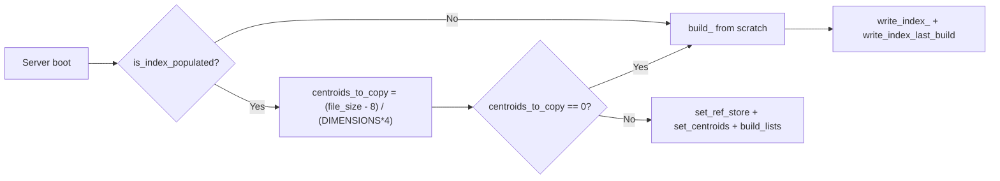
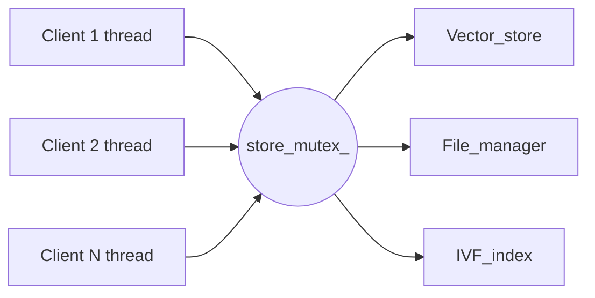
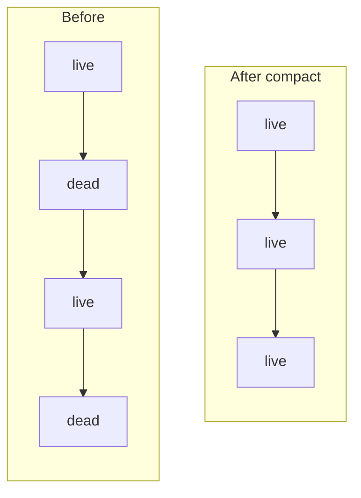

# NeedleDB v2 Engine Architecture & Internals

This document is a technical reference for the NeedleDB v2 C++ storage engine. It covers the on-disk binary schema, persistence model, concurrency implementation, Inverted File Index (IVF) behaviour, and auto-compaction.

It is intended for developers working on the engine or diagnosing storage/index behaviour.  

- **Wire protocol (commands, framing, responses):** see [`protocol.md`](./protocol.md)  
- **Product overview and quick start:** see the root [`README.md`](../README.md)  
- **Python middleware:** see [`middleware.md`](./middleware.md) 

---

## Engine Schema Constants

All structural limits and tuning factors live in `schema.hpp` as `constexpr` values. The server validates on-disk headers against these constants at startup and aborts on mismatch.

| Constant | Value | Description |
| :--- | :--- | :--- |
| `DIMENSIONS` | 1024 | Fixed number of floating-point elements per vector. |
| `ID_LENGTH` | 32 | Maximum byte length for a vector's unique string ID. |
| `META_DATA_LENGTH` | 32 | Maximum byte length per metadata key or value. |
| `META_DATA_KP_PAIRS` | 3 | Maximum metadata key-value pairs per record. |
| `TEXT_MAX_LENGTH` | 1200 | Maximum byte length for an inserted text payload. |
| `VERSION` | 6 | Binary schema version identifier. |
| `MAX_K_SIMILAR` | 30 | Hard upper limit for candidate match count (`top_k`). |
| `MAX_CENTROIDS` | 100 | Target number of k-means clusters for the IVF index. |
| `MAX_PROBES_SEARCH` | 5 | Number of adjacent clusters evaluated during search. |
| `MAX_KMEANS_SAMPLE` | 50000 | Maximum vector sample size for k-means centroid seeding and tuning. |
| `OPTIMIZE_FACTOR` | 2 | Growth multiplier against last build size to trigger optimization warning. |
| `OPTIMIZE_REM_STARTS_AT` | 500 | Minimum active vector count before optimization warnings can trigger. |
| `DELETE_FACTOR` | 8 | Multiplier applied to dead entry count to trigger auto-compaction. |

Deployment-only settings (listen port, file paths) come from `.env` via `env_config.hpp` / `Config`. They do not change the binary record layout.

---

## On-Disk Binary Schema

NeedleDB uses a fixed-size binary layout for $O(1)$ offset access and predictable portability. Layout is packed (`#pragma pack(push, 1)` on the header) so compilers cannot insert silent padding.

### Database Header (`DB_header`)

The entry file begins with a 32-byte header.

| Field | Type | Size | Description |
| :--- | :--- | :--- | :--- |
| `live_vector_count` | `uint64_t` | 8 bytes | Count of active (non-tombstoned) records. |
| `total_vector_count` | `uint64_t` | 8 bytes | Total records appended, including soft-deleted ones. |
| `magic_number` | `char[4]` | 4 bytes | Signature `{'V', 'D', 'B', '\0'}`. |
| `dimensions` | `uint16_t` | 2 bytes | Must match `DIMENSIONS` (1024). |
| `version` | `uint8_t` | 1 byte | Must match `VERSION` (6). |
| `id_length` | `uint8_t` | 1 byte | Must match `ID_LENGTH` (32). |
| `kv_length` | `uint8_t` | 1 byte | Must match `META_DATA_LENGTH` (32). |
| `max_kv` | `uint8_t` | 1 byte | Must match `META_DATA_KP_PAIRS` (3). |
| `padding` | `uint8_t[6]` | 6 bytes | Reserved; keeps the header at exactly 32 bytes. |

### Metadata Entry (`Metadata_entry`)

| Field | Type | Size | Description |
| :--- | :--- | :--- | :--- |
| `key` | `char[32]` | 32 bytes | Fixed-size metadata key. |
| `value` | `char[32]` | 32 bytes | Fixed-size metadata value. |

Strings that occupy all 32 bytes have no trailing `'\0'`. The engine reads them with bounded length checks (`strnlen`-style), not with unbounded C-string functions.

### Database Record (`DB_entry`)

Contiguous records follow the header.

| Field | Type | Size | Description |
| :--- | :--- | :--- | :--- |
| `flag` | `uint8_t` | 1 byte | Tombstone: `1` active, `0` soft-deleted. |
| `id` | `char[32]` | 32 bytes | Unique vector id. |
| `text_offset` | `uint64_t` | 8 bytes | Byte offset into the text database file. |
| `text_length` | `uint16_t` | 2 bytes | Payload length in bytes (≤ 1200). |
| `meta_data` | `Metadata_entry[3]` | 192 bytes | Up to three key-value pairs. |
| `meta_data_count` | `uint8_t` | 1 byte | Number of active pairs (0–3). |
| `embeddings` | `float[1024]` | 4096 bytes | Embedding components. |

**Record size:** 4332 bytes.  
**Offset of record `i`:** `32 + (i × 4332)`.

---

## Persistence Architecture

State is split across three files. Paths are taken from `.env` (`VECDB_ENTRY_DATA_PATH`, `VECDB_TEXT_DATA_PATH`, `VECDB_INDEX_DATA_PATH`).

| File | Role |
| :--- | :--- |
| Entry DB (`database_entry.vdb`) | Header + fixed-size `DB_entry` records. |
| Text DB (`database_text.vdb`) | Append-only heap: 1-byte flag + variable-length text per payload. |
| Index DB (`database_index.vdb`) | `last_build_at` (`uint64_t`) + flattened centroid coordinates. |

**Consistency rules at startup**

- If entry and text files disagree on existence (one present, one missing), the server treats the state as corrupt and errors out.
- If the index file is missing or empty / too small to hold centroids, the server **rebuilds** the IVF index from the live entry set and writes a new index file. Primary entry/text data is not discarded solely because the index is absent.


```mermaid
flowchart LR
    A[Server boot] --> B{is_index_populated?}
    B -- No --> C[build_ from scratch]
    C --> D[write_index_ + write_index_last_build]
    B -- Yes --> E["centroids_to_copy = (file_size - 8) / (DIMENSIONS*4)"]
    E --> F{centroids_to_copy == 0?}
    F -- Yes --> C
    F -- No --> G[set_ref_store + set_centroids + build_lists]
```

Text is read only when needed (for example, when a vector is returned as a top-k hit). Embeddings and metadata used for search stay in the entry file / RAM structures.

---

## TCP Interface (summary)

The engine listens on a TCP port and speaks a line-delimited text protocol (`INSERT`, `QUERY`, `DELETE`, `SAVE`, `LOAD`, `OPTIMIZE`).

**Full request/response grammar, limits, and client guidelines:** [`protocol.md`](./protocol.md).

This document does not duplicate that grammar so the two sources cannot drift.

---

## Concurrency Model

NeedleDB v2 uses a **thread-per-client** design:

1. The main thread blocks in `accept()`.
2. Each accepted connection is handled on a dedicated, detached `std::thread` running `handle_client()`.
3. A single coarse mutex, `store_mutex_`, guards the shared data plane: `Vector_store`, `File_manager`, and `IVF_index`.
4. The mutex is held only for the **execution** of `INSERT`, `QUERY`, `DELETE`, `SAVE`, `LOAD`, and `OPTIMIZE`. Parsing the inbound line and writing the outbound response happen outside the critical section so a slow network peer does not keep the store locked while bytes trickle in or out.


```mermaid
flowchart LR
    C1[Client 1 thread] --> M((store_mutex_))
    C2[Client 2 thread] --> M
    C3[Client N thread] --> M
    M --> S[Vector_store]
    M --> F[File_manager]
    M --> I[IVF_index]
```

**Practical consequences**

- Many clients may connect at once; their commands are serialized only while touching the store.
- A client that spends seconds embedding text or calling an LLM does **not** block the engine during that work — only during each short TCP command.
- `OPTIMIZE`, `LOAD`, and compaction hold the mutex for the whole operation and will delay other clients until they finish.

---

## IVF Indexing & Auto-Compaction

### Inverted File Index (IVF)

Vectors are partitioned with k-means into up to `MAX_CENTROIDS` (100) clusters. A query probes the `MAX_PROBES_SEARCH` (5) nearest centroids and scores candidates in those lists with dot-product similarity on L2-normalized vectors.

**Build cost control:** centroid seeding and the k-means tuning iterations use a random sample of at most `MAX_KMEANS_SAMPLE` (50 000) vectors. A final assignment pass places every live vector into a list.

**Persistence:** centroids and `last_build_at` (live count at last successful build) are stored in the index file so boot can skip a full k-means when the index is valid.

**Staleness:** new inserts are assigned to existing centroids; centroid positions do not move until `OPTIMIZE` or `LOAD`. When live count grows enough relative to `last_build_at`, `INSERT` responses may include an optimize warning (see protocol).

### Auto-Compaction

Soft deletes only flip the tombstone flag. Space is reclaimed when:

```text
(dead_entries × DELETE_FACTOR) ≥ total_vector_count
```

with `DELETE_FACTOR = 8`. Compaction rewrites live records into new entry/text files, replaces the old files, and refreshes RAM structures. It runs under the store mutex.

Temporary compaction files are written beside the real databases (same directory as `VECDB_ENTRY_DATA_PATH` / `VECDB_TEXT_DATA_PATH`, e.g. `…/temp_database.vdb` and `…/temp_text_database.vdb`) so `rename` stays on one filesystem. That avoids Docker failures where the process CWD and the data volume sit on different devices (`Invalid cross-device link`).


```mermaid
flowchart LR
    subgraph Before
        A1[live] --> A2[dead] --> A3[live] --> A4[dead]
    end
    subgraph After[After compact]
        B1[live] --> B2[live] --> B3[live]
    end
    Before ~~~ After
```

---

## Known Limitations

These are deliberate or accepted trade-offs for an educational, inspectable engine — not an exhaustive bug list.

| Topic | Behaviour |
| :--- | :--- |
| **Security** | No authentication, authorization, or TLS. Any peer that can reach the port can run any command. |
| **Blocking maintenance** | Compaction, `OPTIMIZE`, and `LOAD` hold `store_mutex_` for the whole operation. |
| **Compaction durability** | Compaction is not crash-safe: primary files can be removed before replacements are fully in place. An interrupt mid-replace can corrupt the database. Temps are placed next to the configured data files (same directory) so volume-backed Docker deploys can rename without a cross-device error. |
| **ID lookup** | `find_by_id` / in-RAM id resolution are $O(N)$ linear scans. |
| **Stale centroids** | IVF centroids move only on `OPTIMIZE` / `LOAD`, not on every insert. |
| **Index vs data pairing** | A fresh empty entry/text pair can still see an old non-empty index file if only some files were deleted; index freshness is not cryptographically bound to entry/text identity. |
| **Metadata + top-k** | Geometric truncation to `top_k` can run before metadata filtering, so filtered queries may return fewer than `top_k` hits even when more matching vectors exist outside the geometric cut. Full non-overlap falls back to a metadata-oriented path. |
| **Memory** | Active vectors are held in RAM for search. Dataset size is bounded by available memory. |
| **Protocol cost** | Floats travel as decimal text, which is simple to debug and expensive compared to binary frames. |

---

## Related source map

| Area | Primary locations |
| :--- | :--- |
| Schema / POD layouts | `include/schema.hpp` |
| `.env` → `Config` | `include/env_config.hpp` |
| Parsing | `include/command_parser.h`, `src/command_parser.cpp` |
| Disk I/O | `include/file_manager.h`, `src/file_manager.cpp` |
| RAM store | `include/vector_store.h`, `src/vector_store.cpp` |
| IVF | `include/ivf.h`, `src/ivf.cpp` |
| TCP server | `include/vector_server.h`, `src/vector_server.cpp` |
| Entry point | `src/main.cpp` |
